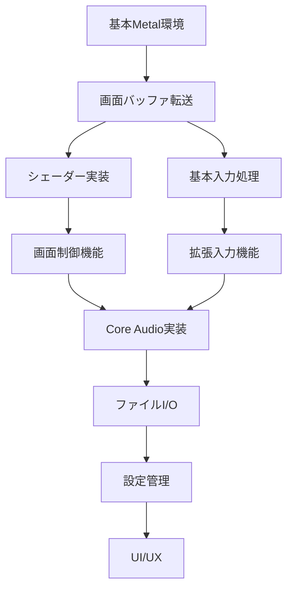

# Xcode移植実装タスク

## タスク一覧

### フェーズ1: 画面描画システム（優先度: 高）

#### 1.1 基本的なMetal描画環境の構築
- [ ] MetalビューとレンダラーのSwift実装
- [ ] C++ブリッジ関数の拡張
- [ ] 基本的な画面バッファ転送機能
- [ ] RGB565からMetalテクスチャへの変換

#### 1.2 シェーダー実装
- [ ] 基本描画用シェーダー（vertex + fragment）
- [ ] エフェクト用シェーダーの移植
  - [ ] ブラーフィルター
  - [ ] スキャンラインエフェクト
  - [ ] グリーンディスプレイ
- [ ] 色覚シミュレーション対応

#### 1.3 画面制御機能
- [ ] ビューポート計算とアスペクト比維持
- [ ] 画面回転対応
- [ ] スケーリングモード（整数倍/スムーズ）
- [ ] フルスクリーン対応

### フェーズ2: 入力システム（優先度: 高）

#### 2.1 基本入力処理
- [ ] キーボード入力の実装
- [ ] マウス/タッチ入力の実装
- [ ] 入力イベントのエミュレータへの伝達

#### 2.2 拡張入力機能
- [ ] ソフトウェアキーボードの統合
- [ ] ゲームコントローラー対応（MFi/Xbox/PlayStation）
- [ ] タッチジェスチャー（ピンチズーム等）
- [ ] キーボードショートカット

### フェーズ3: 音声システム（優先度: 中）

#### 3.1 Core Audio実装
- [ ] AudioUnitまたはAVAudioEngineの選定
- [ ] 音声バッファ管理
- [ ] 低レイテンシ出力の実現

#### 3.2 音声機能拡張
- [ ] バックグラウンド再生対応
- [ ] 音量調整機能
- [ ] 音声デバイス切り替え対応

### フェーズ4: ファイルI/O（優先度: 中）

#### 4.1 基本ファイル操作
- [ ] ディスクイメージの読み込み/保存
- [ ] ステートセーブ/ロード機能
- [ ] 設定ファイルの管理

#### 4.2 iOS/macOSファイルシステム統合
- [ ] ドキュメントピッカー対応
- [ ] アプリケーションサンドボックス対応
- [ ] iCloud Drive統合
- [ ] ファイル共有機能

### フェーズ5: 設定管理（優先度: 低）

#### 5.1 設定システム
- [ ] UserDefaults統合
- [ ] 設定画面UI（SwiftUI）
- [ ] 設定のインポート/エクスポート

### フェーズ6: UI/UX（優先度: 低）

#### 6.1 メニューシステム
- [ ] ネイティブメニューの実装
- [ ] コンテキストメニュー対応
- [ ] ツールバー/タッチバー対応

#### 6.2 その他のUI要素
- [ ] ステータス表示
- [ ] 画面上のコントロール（iOS）
- [ ] ヘルプシステム

## 実装順序と依存関係

## 技術的検討事項

### Metal実装
- MTKViewとMTLRenderPipelineStateの設計
- テクスチャフォーマットの選定（RGB565 vs RGBA8888）
- トリプルバッファリングの実装方法

### Swift-C++統合
- ブリッジ関数の命名規則
- メモリ管理とライフサイクル
- エラーハンドリング

### パフォーマンス最適化
- テクスチャ更新の最適化
- 描画とエミュレーションのスレッド分離
- 電力効率の考慮

## 進捗状況

### 完了したタスク
- [x] プロジェクト構造の調査
- [x] 既存実装の分析
- [x] 技術要件の整理

### 現在作業中
- 基本的なMetal描画環境の構築

### 次の作業予定
- MetalビューとレンダラーのSwift実装